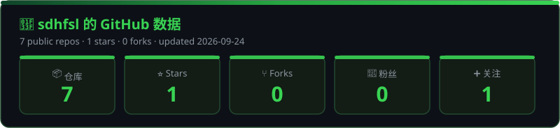
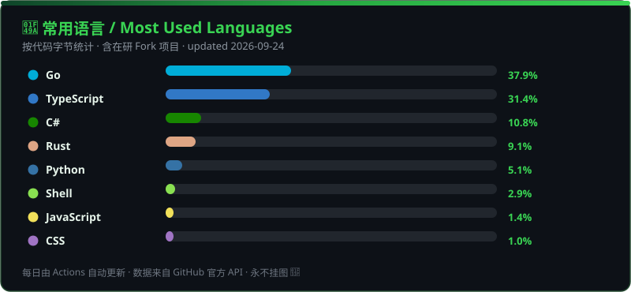

<div align="center">
  
</div>

<div align="center">

[](https://git.io/typing-svg)

<p>
  
  
  
  
</p>

<p>
  
  
  
  
  
</p>

</div>

---

### 🌿 关于我 / About Me


- 🔭 **正在折腾：** `v2rayN` / `3x-ui` / `Clash-Verge-Rev` 全平台代理生态 + `TradingAgents` LLM 量化交易
- 🌱 **正在学习：** `Go` · `C#` · `Python` · `Tauri` · `AI Agents` · `Docker`
- 💡 **信条：** 让网络更自由，让交易更智能 — `Code, Network, Freedom.`
- 📫 **怎么找到我：** 直接在 [Issues](https://github.com/sdhfsl/sdhfsl/issues) 里留言，看到必回！
- 🌿 **Fun fact：** 2026 年 8 月才加入 GitHub，像小草一样每天长一点 🌱

<br clear="both"/>

---

### 🛠️ 技术栈 / Tech Stack

<div align="center">

[](https://skillicons.dev)

<p>
  
  
  
  
  
  
  
  
</p>

</div>

---

### 📊 数据统计 / GitHub Analytics

<div align="center">
  
</div>

<div align="center">
  
</div>

<div align="center">
  
</div>

<div align="center">
  
</div>

---

### 🐍 贪吃蛇 / Contribution Snake

<div align="center">
  <picture>
    <source media="(prefers-color-scheme: dark)" srcset="https://raw.githubusercontent.com/sdhfsl/sdhfsl/output/github-contribution-grid-snake-dark.svg" />
    <source media="(prefers-color-scheme: light)" srcset="https://raw.githubusercontent.com/sdhfsl/sdhfsl/output/github-contribution-grid-snake.svg" />
    
  </picture>
</div>

---

### 🔥 精选项目 / Featured

| 项目 | 简介 | Stars | Forks |
| ---- | ---- | :---: | :---: |
| 📦 [**v2rayN**](https://github.com/sdhfsl/v2rayN) | Windows / Linux / macOS 图形客户端，支持 Xray、sing-box |  |  |
| 🌐 [**3x-ui**](https://github.com/sdhfsl/3x-ui) | 多协议多用户面板：Vmess / Vless / Trojan / WireGuard / Hysteria |  |  |
| 🍀 [**clash-verge-rev**](https://github.com/sdhfsl/clash-verge-rev) | 基于 Tauri 的现代代理客户端，Win / macOS / Linux 通用 |  |  |
| 🤖 [**TradingAgents**](https://github.com/sdhfsl/TradingAgents) | 多智能体 LLM 金融交易框架 |  |  |

---

### 🌱 近期动态 / Now

```text
🌐  Network   ██████████████░░░░   70%  · v2ray / xray / sing-box / clash
🤖  AI Trade  ██████████░░░░░░░░   55%  · LLM Multi-Agents / 量化策略
🖥️  Client    ████████████░░░░░░   60%  · Tauri / C# WPF / 跨平台 GUI
🐳  Ops       ████████░░░░░░░░░░   40%  · Docker / Linux / 部署运维
```

- ✅ Fork 并研究 `2dust/v2rayN`、`MHSanaei/3x-ui`、`clash-verge-rev/clash-verge-rev`
- 🚧 下一步：给 `sdhfsl` 主页加上自己的原创项目 + 写中文使用教程
- 💬 欢迎围观、提 Issue、一起折腾！

---

<div align="center">
  
</div>
